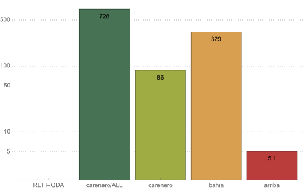

> nlabel is currently alpha software and in an early stage of development.

nlabel is a library for generating, storing and
retrieving tagging information and embedding vectors
from various nlp libraries through a unified interface.

nlabel is also a system to collate results from various
taggers and keep track of used models and configurations.

Apart from its standard persistence through sqlite and
json files, nlabel's binary arriba format combines
especially low storage requirements with high performance
(see benchmarks below).

Through arriba, nlabel is thus especially suitable for

* inspecting many features on few documents
* inspecting few features on many documents

To support external tool chains, nlabel supports exporting
to [REFI-QDA](https://www.qdasoftware.org/downloads-project-exchange/).

## Quick Start

Processing text works occurs in two steps. First, a
NLP instance is built from an existing NLP pipeline:

```python3
from nlabel import NLP

import spacy

nlp = NLP(spacy.load("en_core_web_sm"), renames={
    'pos': 'upos',
    'tag': 'xpos'
}, require_gpu=False)
```

In the example, above nlp now contains a pipeline based
on spacy's `en_core_web_sm` model. We instruct `nlp` to
generate embedding vectors via `vectors`, and to rename
two tags, namely `pos` to `upos` and `tag` to `xpos`.

In the next step, we run the pipeline and look at its
output:

```python3
doc = nlp(
    "If you're going to San Francisco,"
    "be sure to wear some flowers in your hair.")

for sent in doc.sentences:
    for token in doc.tokens:
        print(token.text, token.upos, token.vector)
```

You can ask a `doc` which tags it carries, so

```python3
doc.__tags__
```

In the example above, the result would be:

```python3
['dep', 'ent', 'ent_iob', 'lemma', 'morph', 'pos', 'sentence', 'tag', 'token', 'upos', 'xpos']
```

In the following sections, some of internal concepts
will be explained. To get directly to code that will
generate archives for document collections, skip to
[Importing a CSV to a local archive](import-csv).

### Tags and Labels

nlabel handles everything as tags, even it is has no label.
That means that nlabel regards `tokens` and `sentences` as
as tags with labels. Tags can both be iterated but also asked
for labels. Tags can also be regarded as containers that contain
other tags. The following examples illustrate the concepts:

```python3
for ent in doc.ents:
    print(ent.label, ent.text)
```

outputs

```GPE San Francisco```,

while

```python3
for ent in doc.ents:
    for token in ent.tokens:
        print(ent.label, token.text, token.pos)
```

outputs

```
GPE San PROPN
GPE Francisco PROPN
```

### NLP engines

To plug in a different nlp engine, set `nlp` differently:

```python3
import stanza
nlp = NLP(stanza.Pipeline('en'))
```

Since we renamed `tag` and `pos`, in the spacy example above,
this would work without additional work.

At the moment nlabel has implementations for spacy, stanza,
flair and deeppavlov. You can also write your own nlp data
generators (based on `nlabel.nlp.Tagger`).

While `NLP` usually auto-detects the type of NLP parser you
provide it, there are specialized constructors (`NLP.spacy`,
`NLP.flair`, etc.) that cover some border cases.

### Saving and Loading

Documents can be saved to disk:

```python3
doc.save("demo")
```

By default, this will generate a json-based format that should
be easy to parse, even if you do decide to not use nlabel after
this point - see [bahia json documentation](doc/bahia_json.txt).

Of course, you can also use nlabel to load its own documents:

```python3
from nlabel import Document

with Document.open("demo") as doc:
    for sent in doc.sentences:
        for token in sent.tokens:
            print(token.text, token.upos, token.vector)
```

### Views

`Document`s can be combined into `Collection`s, which will
then contain information from multiple taggers:

```python3
from nlabel import Collection

collection = Collection.join([doc1, doc2])
```

A `collection` contains multiple taggers for *one* shared text.
If you need to collect data for multiple texts, use *archives*
(see below).

To work with collections, it is necessary to select which
tags should get mapped to which name, since tags of the same
name from different taggers would clash otherwise.

Calling `taggers_description` on a `Collection` lists all taggers
and their internals (think: model sheets) that were used to generate
the collection. Heres is a real-world output using two taggers:

```
0:
  env:
    machine: x86_64
    platform: Linux-5.3.18-lp152.60-default-x86_64-with-glibc2.26
    runtime:
      nlpkit: '0.0.1a'
      python: 3.9.7
  library:
    name: spacy
    version: 3.2.1
  model:
    lang: de
    name: core_news_lg
    version: 3.2.0
1:
  env:
    machine: x86_64
    platform: Linux-3.10.0-1160.49.1.el7.x86_64-x86_64-with-glibc2.2.5
    runtime:
      nlpkit: '0.0.1a'
      python: 3.8.6
  library:
    name: stanza
    version: 1.3.0
  model:
    lang: de
```

nlabel does not attempt to give taggers a short string name.

For a `tagger` selector to pick a specific tagger,
it needs to identify unique properties in the description
above. The following example picks four tags from a `spacy`
tagger (assuming there is only one):

```python3
doc = collection.view({
    'tagger.library.name': 'spacy',
    'tags': [
        'sentence',
        'token',
        'pos',
        'ent'
    ]
})
```

The form `'tagger.library.name': 'spacy'` is a short and more
readable form of the following equivalent selector:

```
'tagger': {
    'library': {
        'name': 'spacy'
    }
}

```

If there are multiple spacy taggers, the specification
needs to be more precise to pick exactly one tagger,
for example like this:

```
'tagger': {
    'library': {
        'name': 'spacy',
        'version': '3.2.1'
    },
    'model': {
      "name": "core_web_sm"
    }
}
```

For more details on the structure of the `tagger` section of
the filter above, see the [bahia json documentation](doc/bahia_json.txt).

Tags can be renamed by using `as`, e.g. `sentence as sent`.

### Label types

There are four label types in nlabel:

|          | description                 | notes                            |
|----------|-----------------------------|----------------------------------|
| `labels` | all labels                  | constisting of value and score   |
| `label`  | first label only            | ignores ensuing labels           |
| `strs`   | string list of label values | ignores scores                   |
| `str`    | first label value as string | ignores score and ensuing labels |

`strs` and `labels` are suitable for getting output from taggers that return
multiple labels. 

The default type is `str`. The exception to this rule are morphology tags (e.g.
spacy's `morph` and stanza's `feats`, which default to `strs`).

To specify label types when creating a view on a `Collection`, use `:` in the
tag description, e.g. `pos:str` or `pos_en:labels`.

### Bridging multiple taggers

nlabel can easily switch between labels from different taggers (assuming these
taggers assigned the corresponding tags to same character span).

```python3
doc = collection.view({
        'tagger.library.name': 'spacy',
        'tags': ['sentence', 'token', 'pos as spacy_pos' ]
    }, {
        'tagger.library.name': 'flair',
        'tags': ['pos as flair_pos']
    })

for sent in doc.sentences:
    for token in sent.tokens:
        print(token.text, token.spacy_pos, token.flair_pos)

```

### Computing Embeddings

The following code uses a spacy model to generate token
vectors from spacy's native `vector` attribute:

```python3
nlp = NLP.spacy(
    spacy_model,
    vectors={'token': nlabel.embeddings.native})
```

Spacy's `vector` attribute is usually filled via spacy's own
[`Tok2Vec` and `Transformer` components](https://spacy.io/usage/embeddings-transformers)
or external extensions such as
[spacy-sentence-bert](https://github.com/MartinoMensio/spacy-sentence-bert).

Alternatively, the following code constructs a model that
computes transformer embeddings for tokens via flair:

```python3
nlp = NLP.flair(
    vectors={'token': nlabel.embeddings.huggingface(
        "dbmdz/bert-base-german-cased", layers="-1, -2")},
    from_spacy=spacy_model)
```

`from_spacy` indicates that sentence splitter and tokenizer
should be taken from the provided spacy model.

### Archives

#### Engines

nlabel comes with three different persistence engines:

* `carenero` is for collecting data, esp. in a batch setting - by
supporting restartability and transaction safety, and enabling
export of full data or sub sets of it into bahia or arriba.
* `bahia` is suitable for archival purposes, as it is just
a thin wrapper around a zip of human-readable json files; it is not
the ideal format for exports.
* `arriba` is a binary format optimized for read performance,
it is suitable for data analysis; it is not suitable for exports.

#### Storage Size

The following graph shows data from a real-world dataset,
consisting of 18861 texts (125.3 MB text data), tagged with
4 taggers and a total of 31 tags (no embedding data). Y
axis shows size in GB (note logarithmic scale). REFI-QDA
is roughly 100 times the size of arriba.


#### Random Access Speeds

The exact speed of `arriba` depends on the task and data,
but but often `arriba` performs 10 to 100 times
faster than `bahia` and `carenero` on real-world projects.
From the same data set as earlier (when extracting all POS
tags from one of 4 taggers over 2000 documents):



An analysis that will take minutes in `bahia` usually
finishes in seconds using `arriba`.

#### More Engine Details

These engines support storing both tagging data and
embedding vectors. In the ordering above, they go from slower to faster.

|                       | carenero  | bahia | arriba |
|-----------------------|-----------|-------|--------|
| data collection       | +         | -     | -      |
| exporting             | +         | -     | -      |
| read speeds           | -         | -     | +      |
| suitable for archival | -         | +     | -      |

(*) bahia supports writes, but does not avoid adding duplicates
or support proper restartability in batch settings, i.e. it is
not suited to incremental updates.

### Additional Examples

#### <a name="import-csv">Importing a CSV to a local archive</a>

Create a `carenero` archive from a CSV:

```python3
from nlabel.importers import CSV

import spacy

csv = CSV(
    "/path/to/some.csv",
    keys=['zeitung_id', 'text_type_id', 'filename'],
    text='text')
csv.importer(spacy.load("en_core_web_sm")).to_local_archive()
```

This will create an archive located in the same folder as the
CSV. The code above is restartable, i.e. it is okay to interrupt
and continue later - it will not add duplicate entries.

Once the archive has been created, one can either use it
directly, e.g. iterating its documents:

```python3
from nlabel import open_archive

with open_archive("some/archive.nlabel", mode="r") as archive:
    for doc in archive.iter(some_selector):
        for x in doc.tokens:
            print(x.text, x.xpos, x.vector)
```

Or, one can save the archive to different formats for faster
traversal:

```python3
archive.save("demo2", engine="bahia")
archive.save("demo3", engine="arriba")
```

The `open_archive` call from above works with all archive types.

Note that the `iter` call on archives takes an optional view
description that allows picking/renaming tags as described earlier.

#### Exporting to a remote archive

For larger jobs, it is often useful to separate computation and storage,
and to allow multiple computation processes (both often applies to
GPU cluster environments). Since `carenero`'s sqlite is bad at handling
concurrent writes, the solution is starting a dedicated web service that
handles the writing on a dedicated machine.

On machine A, start an archive server (it will write a carenero archive
to the given path):

```bash
python -m nlabel.importers.server /path/to/archive.nlabel --password your_pwd
```

On machine B, you can start one or multiple importers writing to that remote
archive. Modifying the example from the local archive:

```python3
from nlabel import RemoteArchive

remote_archive = RemoteArchive("http://localhost:8000", ("user", "your_pwd"))
csv.importer(spacy.load("en_core_web_sm")).to_remote_archive(
    remote_archive, batch_size=8)
```

#### Exporting REFI-QDA

The following code exports `ent` tags to a [REFI-QDA](https://www.qdasoftware.org/downloads-project-exchange/) project.

```
from nlabel import NLP

import spacy
nlp = NLP(spacy.load("en_core_web_lg"))
text = 'some longer text...'
doc = nlp(text)

doc.save_to_qda(
    "/path/to/your.qdp", {
        'tagger': {
        },
        'tags': {
            'ent'
        }
    })
```

A `save_to_qda` method is also part of `cantenero` and `bahia` archives.
